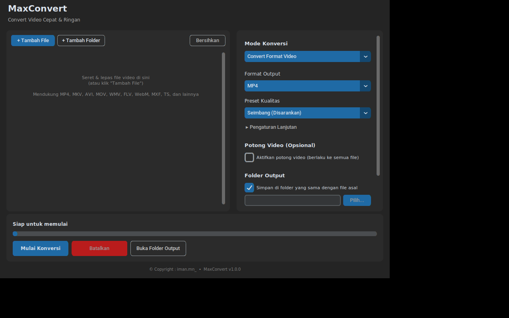

# MaxConvert

**Convert Video Cepat & Ringan** — aplikasi desktop Windows untuk mengonversi video antar berbagai format, dibangun dengan Python + CustomTkinter, dikemas jadi installer siap pakai lewat PyInstaller + Inno Setup, dan di-build otomatis lewat GitHub Actions.



© Copyright : iman.mn_

---

## ✨ Fitur

- **4 Mode Konversi** dalam satu aplikasi:
  - 🎞️ **Convert Format Video** — ubah antar MP4, MKV, AVI, MOV, WebM dengan kontrol penuh atas codec, kualitas, resolusi, dan rotasi.
  - 🎵 **Ekstrak Audio Saja** — ambil audio dari video ke MP3, AAC, M4A, atau WAV.
  - 🖼️ **Convert ke GIF** — video jadi GIF berkualitas tinggi (pakai palet warna otomatis).
  - 📉 **Kompres ke Ukuran Target** — tentukan target MB (ada tombol cepat 16 MB untuk WhatsApp, 25 MB untuk email), bitrate dihitung otomatis pakai 2-pass encoding.
- **Batch processing** — antre banyak file sekaligus, bisa diproses 1–3 file bersamaan.
- **Percepatan GPU otomatis** — mendeteksi & memakai NVIDIA (NVENC), Intel Quick Sync (QSV), atau AMD (AMF) jika tersedia, otomatis jatuh ke CPU jika tidak ada.
- **Drag & drop** file langsung ke jendela aplikasi (dengan fallback tombol biasa jika drag & drop tidak tersedia di sistem).
- **Potong video (trim)** opsional sebelum konversi.
- **Progress real-time** per file dan keseluruhan, lengkap dengan kecepatan proses.
- **FFmpeg terpasang otomatis** saat pertama kali dijalankan — installer aplikasi tetap ringan (~30–50 MB), FFmpeg (~80 MB) diunduh sekali secara otomatis di background hanya jika belum ada di sistem.
- **Ringan** — tidak menyertakan library video Python yang berat; seluruh proses berat didelegasikan langsung ke FFmpeg lewat subprocess.

## 🎬 Format Input yang Didukung

MP4, MKV, AVI, MOV, WMV, FLV, WebM, M4V, MPG/MPEG, 3GP, TS, **MXF**, VOB, OGV, GIF.

(Format MXF disertakan khusus untuk alur kerja broadcast/kamera profesional.)

## 🖥️ Cara Pakai (Pengguna Akhir)

1. Pasang MaxConvert lewat `MaxConvert-Setup.exe` (lihat [PANDUAN_BUILD.md](PANDUAN_BUILD.md) untuk cara mendapatkannya).
2. Buka MaxConvert. Saat pertama kali dibuka, aplikasi akan mengunduh komponen FFmpeg secara otomatis (butuh koneksi internet, sekali saja).
3. Tambahkan file lewat tombol **+ Tambah File** / **+ Tambah Folder**, atau seret file video ke jendela aplikasi.
4. Pilih **Mode Konversi** dan atur pengaturan sesuai kebutuhan.
5. Klik **Mulai Konversi**.

## 📁 Struktur Proyek

```
MaxConvert/
├── main.py                    # Entry point aplikasi
├── src/
│   ├── gui.py                 # Antarmuka utama (CustomTkinter)
│   ├── converter.py           # Mesin konversi (menjalankan & memantau FFmpeg)
│   ├── command_builder.py     # Penerjemah pengaturan -> argumen FFmpeg
│   ├── ffmpeg_manager.py      # Deteksi/unduh FFmpeg otomatis, deteksi GPU
│   ├── constants.py           # Konstanta aplikasi (format, preset, dll)
│   └── utils.py                # Fungsi bantu
├── assets/icon.ico             # Ikon aplikasi
├── maxconvert.spec             # Konfigurasi PyInstaller
├── installer.iss               # Skrip Inno Setup
├── requirements.txt
└── .github/workflows/build.yml # Workflow build otomatis
```

## 🔨 Build dari Source

Lihat [PANDUAN_BUILD.md](PANDUAN_BUILD.md) untuk panduan lengkap build lokal maupun build otomatis lewat GitHub Actions (rekomendasi — tidak perlu Windows di komputer Anda).

## 🛠️ Teknologi

Python 3.12 · CustomTkinter · FFmpeg · PyInstaller · Inno Setup · GitHub Actions

## Lisensi

© Copyright : iman.mn_
